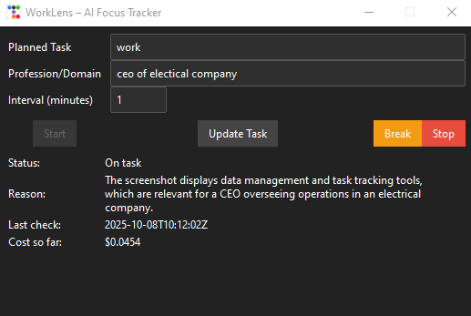
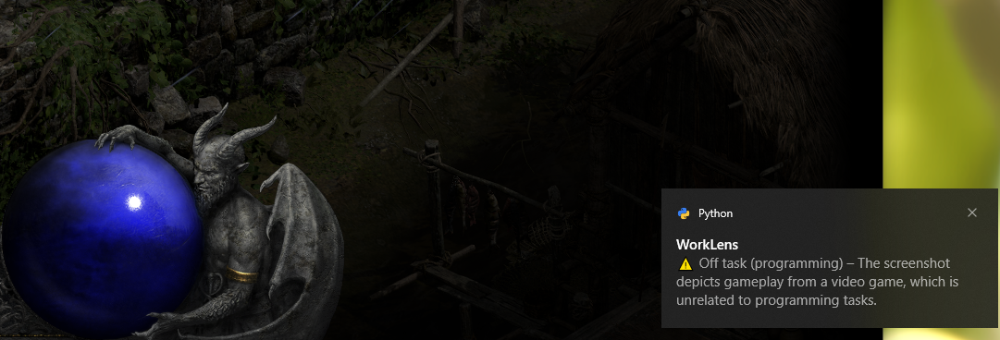

# WorkLens – AI Focus Tracker


WorkLens is a lightweight desktop assistant that helps you stay on task by periodically analyzing screenshots of your primary monitor and checking whether your activity matches the planned task you set. It uses OpenAI's GPT-4o-mini with structured outputs to provide concise on/off-task assessments and reasons.

## Screenshots
- App UI:

  

- Off-task alert example:

  

## Features
- Simple always-on-top Tkinter UI
- Enter planned task, profession/domain, and interval between checks
- Start, Update Task (without restart), Break/Resume (auto 60 min), and Stop controls
- On/Off-task status with brief reason
- Token usage and cost tracking
- Logs all activity to `logs/activity.log`
- Windows toast notifications (only when off-task)

## How to use
- Planned Task: A short description of what you intend to work on (e.g., "invoices", "coding bug #123", "respond to emails").
- Profession/Domain: Your role or field (e.g., "IT support engineer", "CEO electrical contractor"). This helps the AI understand which tools/windows may be normal for you and reduces false flags.
- Interval (minutes): How often to check your screen. Shorter intervals mean more frequent checks and slightly higher cost; longer intervals save cost. A common choice is 5–15 minutes.
- Start: Begins background monitoring.
- Update Task: Apply changes to fields immediately without stopping (task, profession, interval).
- Break/Resume: Pauses checks for 60 minutes with a visible countdown, or resume early.
- Stop: Stops monitoring.

## Installation
Windows + Python 3.13 (64-bit) recommended.

```bash
git clone https://github.com/Vallehtelia/WorkLens.git
cd WorkLens
```

Create and activate a virtual environment (recommended):

```bash
py -3.13 -m venv .venv
.venv\Scripts\activate
python -m pip install --upgrade pip wheel
```

Install dependencies:

```bash
pip install -r requirements.txt
```

If you run into compiler errors (rare on Windows), install the "Desktop development with C++" workload from Visual Studio Build Tools, then retry the install.

## Setup
- Set your `OPENAI_API_KEY` in your environment or create a `.env` file with:
  ```env
  OPENAI_API_KEY=your_api_key_here
  ```
- Optionally edit `config.json` after first run. Example:
  ```json
  {
    "planned_task": "billing",
    "interval_minutes": 10,
    "image_width": 1280,
    "api_key_env": "OPENAI_API_KEY",
    "profession": "IT support engineer"
  }
  ```

## Custom icon/logo
- Place an ICO file at `WorkLens/images/icon.ico` to set the taskbar/window icon (preferred on Windows).
- Optionally place a PNG at `WorkLens/images/logo.png` (displayed at the top of this README and used as a window iconphoto).

## Run
Run the app as a module from the repository root so package imports work correctly:

```bash
python -m WorkLens.main
```

(Troubleshooting: If you see "attempted relative import with no known parent package", ensure you are in the repository root and use `python -m WorkLens.main`.)

## Build executable
Use PyInstaller from the repository root. The command below bundles the app into a single executable (no console window) with your icon:

```bash
pip install pyinstaller
pyinstaller --onefile --noconsole -n WorkLens -p . --icon WorkLens\images\icon.ico --add-data "WorkLens\images\icon.ico;WorkLens\images" WorkLens\main.py
```

The built executable will be in `dist/WorkLens.exe`.

## Cost tracking
We track tokens from responses and estimate cost using:
```
(input_tokens / 1,000,000 * 0.15) + (output_tokens / 1,000,000 * 0.60)
```
These values are summed over the session to report cost so far.

## Privacy
Screenshots are captured locally and only the minimal resized JPEG is sent to OpenAI for analysis. No screenshots are stored persistently; only aggregated results and short reasons are logged. You can delete `logs/activity.log` anytime.

## Notes on accuracy
The model considers your profession/domain to reduce false flags. It will err on the side of on-task if evidence is ambiguous and plausibly related to your profession.

## License
MIT
